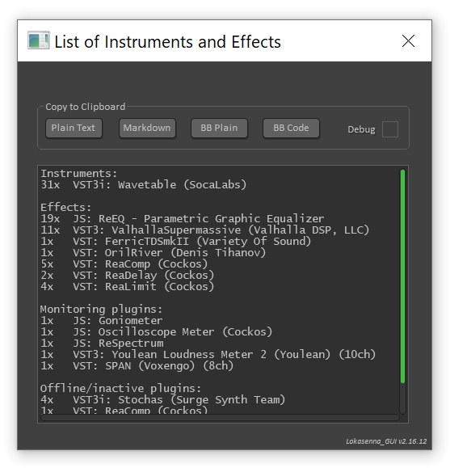

# ListOfInstrumentsAndEffects
This is a Lua script, which lists all Reaper plugins used in an active project, grouping them into categories.
The motivation comes from KVR OSC (KVRaudio One Synth Challange) competition, which requires providing technical details of the production.

When running the script, it immediately shows results in the opened window.
Further, it provides a few buttons allowing copying the result to the clipboard. 
Currently available options are:
* plain text - it's the text shown in the preview window
* markdown - results are formatted into tables using markdown syntax
* BB plain - results use some BBcode formatting, like bold
* BB [code] - results are enclosed into `[CODE] [/CODE]` BBcode tags, to force fixed-width fonts

Note, that every press of Copy to clipboard button generates the report again, including a refresh of displayed content
Normally the report shown in the script window is plain text, regardless format selected by pressing the export button. With the `debug` checkbox checked, the report shown in the window will be the same as the content copied into the clipboard.

# ReaPack
The repository is ReaPack compliant. Use [this link](https://raw.githubusercontent.com/michalk-k/ListOfInstrumentsAndEffects/main/index.xml) to import the repo to your collection of ReaPack repositories.

